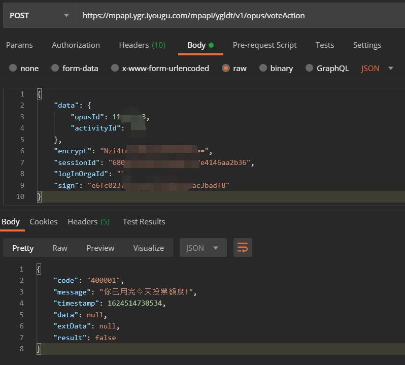

# mini_programs_crack

## 描述

微信小程序`优谷朗读`逆向，实现自动投票功能。

## :hearts: 记录一次微信小程序逆向探索过程（需实现自动投票）

## :eyeglasses:  文件说明
`pkg/_72159787_329.wxapkg`是微信小程序`优谷朗读`的包

`pkg/_72159787_329`是反编译后的工程文件

`wxappUnpacker-master`是反编译工具`wxappUnpacker`的目录

`get_signature/get_sign_param.js`是获取签名参数的脚本，执行如下命令：

```shell script
node get_signature/get_sign_param.js
```
> 执行前需替换`get_signature/get_sign_param.js`中的`sessionId`参数

### 1、抓包分析

打开抓包工具Fiddler，在`优谷朗读`投票过程中抓到下面关键请求
```shell
url:https://mpapi.ygr.iyougu.com/mpapi/ygldt/v1/opus/voteAction

post data:
    {
        "data": {
            "opusId": xxxx,
            "activityId": xxxx
        },
        "encrypt": "xxxx",
        "sessionId": "xxxx",
        "logInOrgaId": "",
        "sign": "xxxx"
    }

return data:
    {
        "code": "200000",
        "message": "成功",
        "timestamp": xxxx,
        "data": "xxxx",
        "extData": null,
        "result": true
    }
```    

经过分析，每次投票请求中，`opusId、activityId、sessionId`三个参数均无变化，`logInOrgaId`为空，`encrypt、sign`两个参数一直在变。

初步判断，`sessionId`是由微信生成的小程序会话ID，`encrypt、sign`两个参数是签名函数生成，并且是由时间做为种子。

### 2、小程序逆向解压

每当打开一个新的微信小程序时，微信会把小程序压缩包（后缀名.wxapkg）下载到本地，可以在以下目录中寻找：

```shell
/data/data/com.tencent.mm/MicroMsg/{数字串}/appbrand/pkg/
```

之后需要将wxapkg包反编译至源码，这里使用下面的开源项目解压：
- wxappUnpacker - <https://github.com/xuedingmiaojun/wxappUnpacker>

> 经测试，从windows wechat PC中获取的wxapkg包不能被wxappUnpacker反编译，从android中获取wxapkg包成功被反编译成源码

### 3、源码分析

用微信开发者工具打开解压缩后的工程文件，全局搜索`sign、encrypt`等关键词，成功找到签名函数，将签名函数提取出来，执行后得到的签名参数`encrypt、sign`可成功请求投票

> 正如之前的猜想一致，`sign、encrypt`参数是由时间做为种子，加上特定的盐，经过`AES和MD5`加密后得到

### 4、结尾

经测试，由本地签名后的请求可成功投票，不过还是不能无限刷投票，每个微信打开小程序会获得一个sessionId，这个sessionId每次是不变的。只要有这个sessionId，加上时间和密钥签名之后，就可以构造请求投票，不过每个微信号每天只能投10票。




